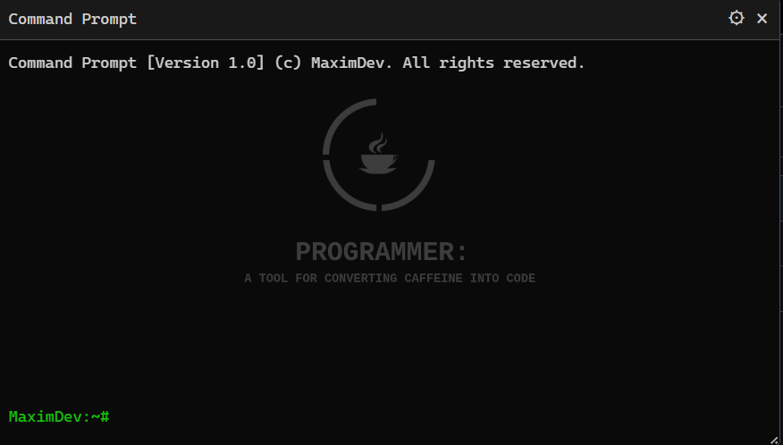

# WebPrompt
## English description
This script brings a Windows Terminal-inspired command prompt to your browser. Seamlessly integrated into websites, it offers a lightweight and interactive way to execute commands or perform quick tasks directly in your browser environment. 

#### Key Features:
* **Windows Terminal Style**: A sleek, dark-themed terminal interface designed to resemble the familiar look and feel of Windows Terminal.
* **Shortcut Activation**: Quickly access the terminal by pressing `Right Ctrl + Right Shift + Right Alt`, ensuring ease of use without interfering with regular workflows.
* **Custom Command Support**: Tailor commands to your specific needs, making it perfect for developers, testers, or power users.
* **Cross-Site Compatibility**: Works on any website, transforming your browser into a more versatile tool.

With this script, you can streamline tasks, enhance productivity, and bring a touch of command-line magic to your everyday browsing.

The prompt looks like this:

[Changelog](CHANGELOG.md)

**Found any issues or want a new feature?** Write them in the [Issues](https://github.com/MAX1MDEV/WebPrompt/issues) section as a *Bug Report* or *Feature Request*.

### Supported commands
| **Command**                              | **Function**                                                                                   |
| :--------------------------------------- | :-------------------------------------------------------------------------------------------- |
| **help**                                 | Displays help information for available commands.                                              |
| **clearcache**                           | Clears the browser cache and reloads the current page.                                         |
| **cls**                                  | Clears the console.                                                                            |
| **savesite / savesiteimages / savesitevideos / savesitemedia** | Saves the current site or its media files (images, videos, and more).                          |
| **language**                             | Switches the console language.                                                                 |
| **screenshot**                           | Takes a screenshot of the current page.                                                        |
| **translate**                            | Translates the page into the selected language (available options: en, ru, es, fr, de, it, pt, ja, ko, zh-CN, ar). |
| **darkmode**                             | Enables dark mode on any page.                                                                 |
| **timer**                                | Sets a timer.                                                                                  |
| **calc**                                 | Opens a calculator for performing calculations.                                                |
| **weather**                              | Displays the current weather for a specified location.                                         |
| **summarize**                            | Provides a brief summary of the current page.                                                  |
| **steam**                                | Clearing whitelist in Steam and calculating income in Steam purchase history.                      |

### Installation
1. Install one of the browser extensions to run user scripts.  
   Tampermonkey: [Chrome](https://chrome.google.com/webstore/detail/tampermonkey/dhdgffkkebhmkfjojejmpbldmpobfkfo), [Firefox](https://addons.mozilla.org/en-US/firefox/addon/tampermonkey/), [Opera](https://addons.opera.com/en/extensions/details/tampermonkey-beta/), [Edge](https://microsoftedge.microsoft.com/addons/detail/tampermonkey/iikmkjmpaadaobahmlepeloendndfphd)  
   Violentmonkey: [Chrome](https://chrome.google.com/webstore/detail/violentmonkey/jinjaccalgkegednnccohejagnlnfdag), [Firefox](https://addons.mozilla.org/en-US/firefox/addon/violentmonkey/), [Maxthon](https://extension.maxthon.com/detail/index.php?view_id=1680), [Edge](https://microsoftedge.microsoft.com/addons/detail/violentmonkey/eeagobfjdenkkddmbclomhiblgggliao)  
2. Go [here](/../../raw/main/WebPrompt.user.js).
3. Confirm installation of the script.

Automatic updating of the script may require your confirmation.

***

## Русское описание
Этот скрипт добавляет командную строку в стиле Windows Terminal прямо в ваш браузер. Легко интегрируемый на любой сайт, он предоставляет удобный и интерактивный инструмент для выполнения команд или быстрых действий в веб-среде.

#### Основные возможности:
* **Стиль Windows Terminal**: Элегантный интерфейс в темной теме, повторяющий стиль Windows Terminal.
* **Удобный вызов**: Открывайте терминал сочетанием `Правый Ctrl + Правый Shift + Правый Alt`, что обеспечивает удобство использования без конфликта с основными задачами.
* **Поддержка пользовательских команд**: Настраивайте команды под свои нужды, что делает скрипт идеальным для разработчиков, тестировщиков и продвинутых пользователей.
* **Совместимость с любыми сайтами**: Работает на всех веб-страницах, превращая ваш браузер в более универсальный инструмент.

С помощью этого скрипта вы сможете автоматизировать рутинные задачи, повысить продуктивность и добавить элементы командной строки в повседневное использование браузера.

Консоль выглядит так:

[Список изменений](CHANGELOG.md)

**Нашли проблему или хотите предложить новую команду?** Напишите об этом в [Issues](https://github.com/MAX1MDEV/WebPrompt/issues) как *Bug Report* или *Feature Request*.

### Поддерживаемые команды
| **Команда**                              | **Функция**                                                                                     |
| :--------------------------------------- | :-------------------------------------------------------------------------------------------- |
| **help**                                 | Вывод справочной информации по доступным командам.                                             |
| **clearcache**                           | Очищает кэш браузера и перезагружает текущую страницу.                                         |
| **cls**                                  | Очищает консоль.                                                                               |
| **savesite / savesiteimages / savesitevideos / savesitemedia** | Сохраняет текущий сайт или его медиа-файлы (изображения, видео и другое).                      |
| **language**                             | Переключает язык консоли.                                                                      |
| **screenshot**                           | Создает скриншот текущей страницы.                                                             |
| **translate**                            | Переводит страницу на выбранный язык (доступные языки: en, ru, es, fr, de, it, pt, ja, ko, zh-CN, ar). |
| **darkmode**                             | Включает темный режим на любой странице.                                                      |
| **timer**                                | Устанавливает таймер.                                                                          |
| **calc**                                 | Открывает калькулятор для выполнения расчетов.                                                 |
| **weather**                              | Показывает текущую погоду для заданного местоположения.                                        |
| **summarize**                            | Выводит краткую информацию со страницы.                                                       |
| **steam**                                | Очистка спика желаемого в Steam и расчет дохода в истории покупок Steam.                       |

### Установка
1. Установить одно из браузерных расширений для выполнения пользовательских скриптов.  
   Tampermonkey: [Chrome](https://chrome.google.com/webstore/detail/tampermonkey/dhdgffkkebhmkfjojejmpbldmpobfkfo?hl=ru), [Firefox](https://addons.mozilla.org/ru/firefox/addon/tampermonkey/), [Opera](https://addons.opera.com/ru/extensions/details/tampermonkey-beta/), [Edge](https://microsoftedge.microsoft.com/addons/detail/tampermonkey/iikmkjmpaadaobahmlepeloendndfphd?hl=ru-RU)  
   Violentmonkey: [Chrome](https://chrome.google.com/webstore/detail/violentmonkey/jinjaccalgkegednnccohejagnlnfdag?hl=ru), [Firefox](https://addons.mozilla.org/ru/firefox/addon/violentmonkey/), [Maxthon](https://extension.maxthon.com/detail/index.php?view_id=1680), [Edge](https://microsoftedge.microsoft.com/addons/detail/violentmonkey/eeagobfjdenkkddmbclomhiblgggliao?hl=ru-RU)   
2. Перейти [сюда](/../../raw/main/WebPrompt.user.js).
3. Подтвердить установку скрипта.

При автоматическом обновлении скрипта может потребоваться ваше подтверждение.
